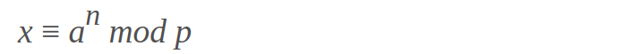
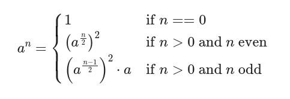
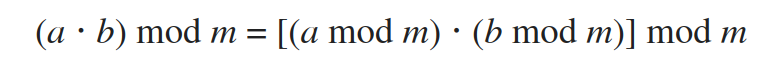

# Modular Exponentiation Homework

## Identifying information

Yacine ELHAMER - 


# Modular Exponentiation:

Modular exponentiation is an arithmetic operation defined as regular integer exponentiation followed by calculating the division remainder of theresult by another number. Put more simply, it is the problem of finding the integer _x_ which corresponds the the natural number _n_ in the equation bellow, wherein _a_ and _p_ are fixed values:



Modular exponentiation is a crucial operation for many cryptographic algorithms to function properly, especially asymetric public-key encryption algorithms such as the RSA algorithm. These functions are usually computationally-expensive since they often deal with the generation and the manipulation of large prime numbers, which is a critical for their security and reliability; Therefore, the operation of modular exponentiation must be quite efficient in order for the aforementioned class of cryptographic functions to be reliable and usable in real-world applications, which is the purpose of this report.

This report discusses some modular-exponentiation algorithms that widely used in modern cryptographic implementations, as well as giving their implementation in C and stating their time complexity.

## Naive Modular Exponentiation:

This algorithm is quite intuitive, it calculates the exponent by multiplication, and then find the remainder by means of a regular modulo operation. Its complexity is given by O(n), and its C implementation is as follows:

```C
int naive_exponent(int a, int n, int p) {
	int exponent = 1;

	for(int i = 0; i < n; i++) 
		exponent *= a;

	return exponent % p;
}
```

Although this algorithm is quite primitive, it was mentioned because it is quite fundamental for the working of the next algorithm: Binary Exponentiation:

## Binary Modular Exponentiation :

This algorithm is quite similar to the previous one, but it improves on it by reducing the number of iterations, and thereby making it O(log n) as opposed to O(n).

The notion that is fundamental to the function of this algorithm is that if have to calculate the exponent of a number _a_ to an even number _n_, then instead of doing _n_ multiplications, we could do _n/2_ exponentiations to calculate _a^(n/2)_, and then square this number therby doing _n/2 + 1_ multiplication operations; And if the number _n_ is odd, then we do the previously described computation to find _a^(n-1)_, and then multiply that by the number _a_.

Furthermore, we could repeat this operation recursively for calculating the exponent _a^(n/2)_ and _a^(n/4)_ and so on, which gives us the following recursive definition of this function: 



After obtaining the exponent, we can use the modulo operation to find the remainder of division by the number _p_, which does not affect the execution time since the modulo operation is O(1).

The time complexity of this function is O(log n), which is quite faster than its previous counterpart.

An implementation of it is as follows:

```C
long long int bin_exp(int a, int n) {
	long long int res;

	if(n == 0) {
		return 1;
	
	} else if(n % 2 == 1) {
		res = bin_exp(a, (n-1)/2);

		return res * res * a;

	} else {
		res = bin_exp(a, n/2);

		return res * res;
	}
		
}

int bin_mod(int a, int n, int p) {
	return bin_exp(a, n) % p;
}
```

## Memory-Efficient Binary Exponentiation:

This method is useful when keeping the numbers small is a requirement; For example, numbers in the C programming language cannot get any bigger than 2^64, and since prime numbers (and consequently their exponents) can get quite large, the size of the numbers and whether the technologies we are using can handle these numbers or not, which brings us to the use of this algorithm.

This algorithm works by taking use of the following identity:



As a result, instead of letting the numbers get exponentially large, this algorithm makes sure to trim them by applying the modulo operation before proceeding.

This alorithm can also be coupled with other algorithms we have seen previously when memory usage is more of a concern than CPU time, but this does not mean that this operation is going to heavily effect the complexity of our algorithm.

the C implementation for this algorithm is as follows:

```C
int mem_eff(int a, int n, int p) {
	int remainder = 1;

	for(int i = 0; i < n; i++) {
		remainder = (remainder * a) % p;
	}

	return remainder;
}
```
